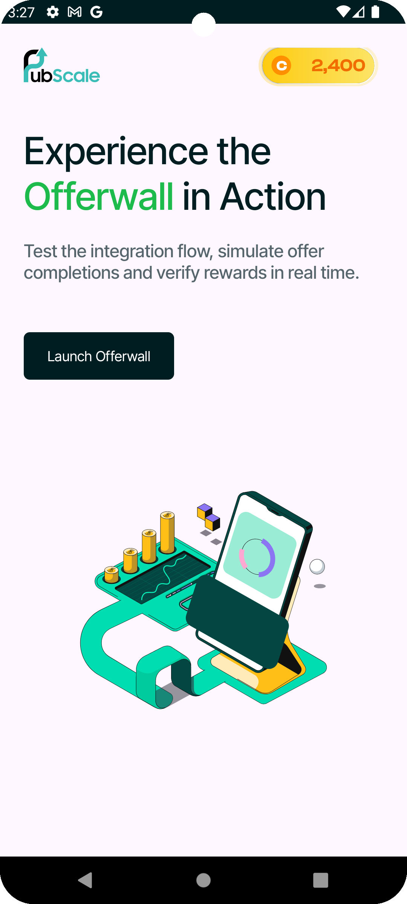

# 🧩 Pubscale Offerwall SDK – Sample Android Integration

This repository provides a simple Android project demonstrating the integration of the [Pubscale Offerwall SDK](https://pubscale.com/offerwall) using Kotlin. It showcases initializing the offerwall, launching and using the listeners for the offerwall.

---

## Documentation: 
https://pubscale.gitbook.io/offerwall-sdk/basic-integration/android-integration

---

## 🚀 Features

- Integration of Pubscale Offerwall via SDK
- Callback handling for various events
- Helper function to create a persistent user ID

---

## 🛠️ Setup Instructions

1. **Clone the Repository**
   ```bash
   git clone https://github.com/GreedyGame/demo-offerwall-android.git
2. **Open in Android Studio**
3. **Update the SDK Key**
   Get the offerwall app ID from the [dashboard](https://dashboard.pubscale.com) by creating an offerwall placement.
4. **Run the App**
   Run the app and experience the PubScale offerwall.

---

## 📱 Screenshots

| Home Screen | Offerwall |
|-------------|-----------|
|  |  |
